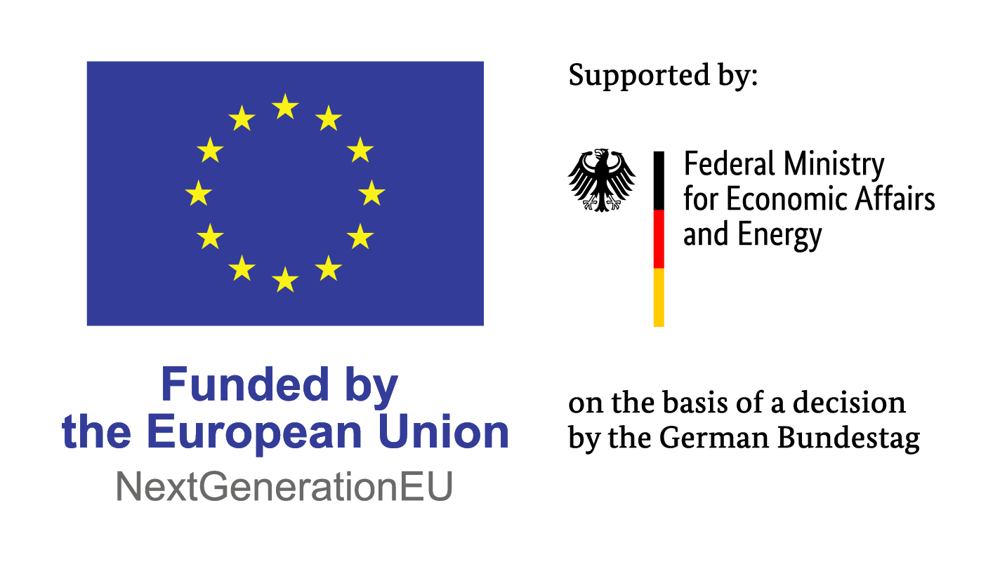

# KIT framework backend

The backend is responsible for executing a KIT. 
Executing a KIT means that accessing all the specified dataspace assets in the KIT and placing them at the right location (e.g., directory, registry).

- `backend-api` handles the user requests via API
- One or more `backend-worker` instances handle tasks concurrently on multiple machines or one machine
- `backend-db` stores KITs and record the execution history
- `backend-redis` handles messaging between api and workers

## Run 

```bash
docker compose up --build -d
```

For those with Kubernetes environment, you can also enable the kubernetes deployment.
```bash
export KUBECONFIG_HOST_PATH="$HOME/.kube/config"

docker compose \
  -f docker-compose.yml \
  -f docker-compose.kubernetes.yml \
  up -d
```
Then run the execution engine (you need the .venv activated)

Node inputs and outputs are exchanged through the `execution_artifacts` Docker
volume rather than Redis, so large binary values do not enter the task broker.
The worker mounts `/var/run/docker.sock` for Docker-backed node types. Remove
that mount if those nodes are not used; access to the Docker socket grants the
worker host-level Docker privileges.

### Accessing DB Console

```
psql -U postgres -d workflowdb
```

In the container:
```
docker exec -it canvas-execution-db psql -U admin -d workflowdb
```

### Checking DB

To see the tables
```
\dt
```

To see the contents
```
SELECT * FROM workflows;
```


## Development: Code Quality (Optional)

Run `ruff` for formatting and linting via

```bash
ruff format
ruff check
```

Run `mypy` for type checking via

## Funding

This open-source project was developed within the *[ROX](https://www.project-rox.ai/en/)* project. 
This project has received public funding from the **European Union** NextGenerationEU within the Important Project of Common European Interest – Cloud Infrastructures and Services (IPCEI-CIS) under grant agreement 13IPC034.

<p align="center">
  
</p>
