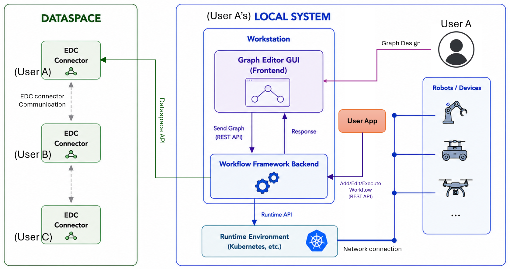
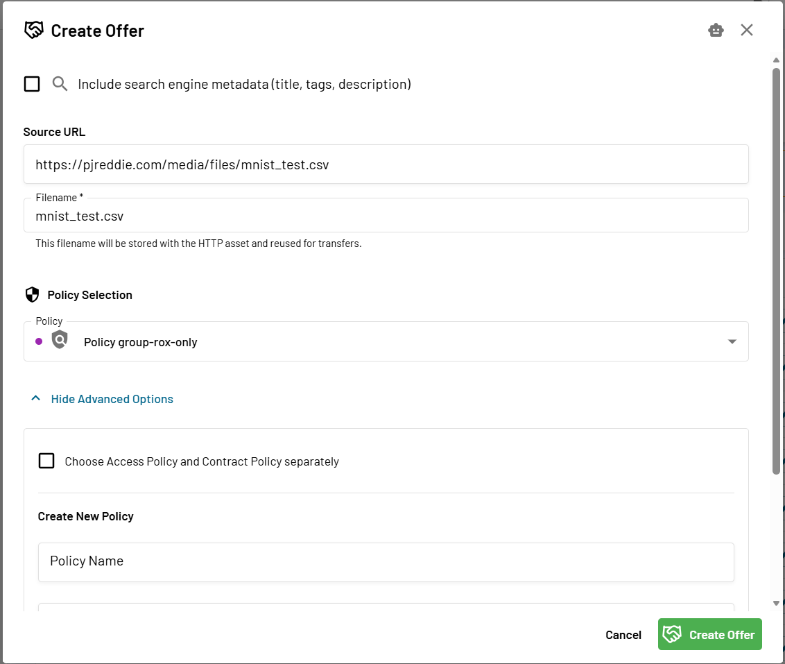
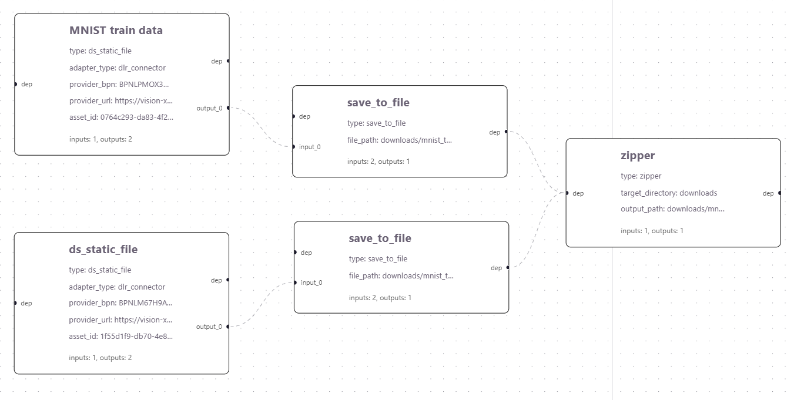

# Dataspace Workflow Execution Engine (Beta)

The *Dataspace Workflow Execution Engine* executes workflow graphs provided as input in JSON format. 
The workflow implements the KIT (Keep-It-Together) concept by composing a set of dataspace assets into a single executable pipeline.
The asset providers (or system designers) can create workflows to ensure that the associated dataspace assets are accessed and executed in the predefined sequence.
In contrast, consumer users can use the dataspace assets within their application simply by executing the workflow.

The overarching concept and the workflow graph specification are found in:
- [docs/concept_overview.md](./docs/concept_overview.md)
- [docs/graph_specification.md](./docs/graph_specification.md)

> [!NOTE]
> The execution engine is currently in beta

## System Overview

This repository contains: 
- Execution backend engine
- A GUI tool for workflow design and visualisation

Below illustrates how these are setup and used in a system.



* User A is the end user operating the robotic system.
* The local system hosts both the frontend and the backend execution engine (GUI is optional).
* The human user can create/import workflow graphs and trigger the execution through the frontend GUI.
* The backend engine can communicate with the local system via the REST API.
* The backend engine sends and receives data from the User A's dataspace connector via the Dataspace APIs.
* The backend engine can communicate with runtime environments (e.g., Kubernetes) to deploy container images received from the datsapce.
* The backend engine can also write the data received from dataspace into the local file in the memory.

## Setup

Install either with `pip` or `uv`. 

```bash
uv sync --all-extras
```

```bash
pip install -e .[dev]
```

Next, prepare the `.env` file.

```bash
cp .env.example .env
```

Open the `.env` file and provide necessary information to access either DLR or T-System dataspaces.
```
BASE_URL_DLR_CONNECTOR=...
API_KEY_DLR_CONNECTOR=...
```

### Graph Editor GUI (Optional)

Generally, the workflow can be created manually in JSON format, and sent to the backend engine via Rest API for execution.

However, using the provided GUI allows human users to visually design the graph and execute with a single button click.

To install, go to the react-flow directory:
```
cd react-flow
```

Then, install a React-Flow server. Note that you need `npm` with version >10.
```
npm create vite@latest react-flow-editor -- --template react
cd react-flow-editor
npm install
npm install @xyflow/react
```

Then, copy the `react-App.jsx` file
```
cp ../App.jsx src/App.jsx
```

Check if everything is installed correctly
```
npm list @xyflow/react
```

If (empty) is shown, then try again:
```
npm install @xyflow/react
```

## Run

First run the database needed for the executione engine.

```bash
docker compose up --build -d
```

Then run the execution engine (you need the .venv activated)

```bash
python main.py
```

Alternatively using `uv`, 

```bash
uv run python main.py
```

In another terminal, run the GUI:
```
cd react-flow/react-flow-editor
npm run dev
```

### Development: Code Quality (Optional)

Run `ruff` for formatting and linting via

```bash
ruff format
ruff check
```

Run `mypy` for type checking via

## Getting Started

We will go through a simple example, in three steps:

1. we will create our own asset and contract in the dataspace
2. we will create a workflow using dataspace assets, including the asset we created in Step 1.
3. we will execute the created workflow to observe the result

Before you begin, make sure you have set up the backend and GUI and prepared the .env file.

> [!NOTE]
> In this example, we will use the DLR dataspace. 
> However, the exact same steps can be taken in the T-System dataspace.

### Step 1: Asset and contract creation

We will create an offer (i.e., asset + contract) using the dataspace web interface. 

- For DLR dataspace, the step-by-step instrcution is provided in [asset_creation_dlr_dataspace.pdf](./docs/asset_creation_dlr_dataspace.pdf)
- To provide the asset metadata correctly, you can refer to [asset_metadata_specification.md](./docs/asset_metadata_specification.md).

The purpose of asset metadata is to
- *enable advanced search* by using the semantic model attributes and values (note: even without the semantic model, the basic search by name still works)
- *find compatible assets* that can substitute existing ones in a workflow (i.e., workflow reconfiguration) 
- *automatically populate parameter values* during workflow design

However, in this example, we will not use the search functionality, and parameter values will be entered manually during workflow design.
Therefore, for now, you can simply create an asset without metadata.

Let's create an asset using an open source dataset: https://pjreddie.com/media/files/mnist_test.csv. 

Create an offer with the values like the image below. `Filename = mnist_test.csv` and `Policy = group-rox-only`. 




### Step 2: Design your workflow

Here, we create a workflow which will:
1. download `mnist_test.csv` and `mnist_train.csv` assets from the dataspace
2. save them into files in the local memory at the path `downloads/mnist_csv/`
3. compress the two files into a zip file at the path `downloads/mnist_csv.zip`

This example workflow demonstrates how to download dataspace assets and store them in a desired local directory structure, making them available for use by local applications.

Let's create the workflow. First, access the GUI at http://localhost:5173/

On the left panel, the drop-down menu shows a list of node types. 

Select `ds_static_data` and click the `add node` button.

Click the created node. In the left panel, you can see where to enter the parameter values.

Give the label `MNIST train data`, and set the parameter values as below:
```yaml
type: ds_static_file
adapter_type: dlr_connector
provider_bpn: BPNLPMOX3Q8EO06P
provider_url: https://vision-x-api.base-x-ecosystem.org/connectors/rox-test-connector/cp/protocol
asset_id: 0764c293-da83-4f24-8901-99c68580dcd8
```
This is the `mnist_train.csv` offer provided by `rox-test` user, whch can be searched in the web UI catalog: https://vision-x-dataspace.base-x-ecosystem.org/#/catalog.

Next, create a node type `save_to_file`. 

Connect the `output_0` of MNIST Test Data to `input_0` of the save_to_file node.

Set the parameter of the save_to_file node to:
```yaml
file_path: downloads/mnist_train.csv
```

Create another `ds_static_data` node.
Give the label `MNIST test data` and parameters:
```yaml
type: ds_static_file
adapter_type: dlr_connector
provider_bpn: BPNLM67H9AVUVPTD
provider_url: https://vision-x-api.base-x-ecosystem.org/connectors/dlr-rox-conn/cp/protocol
asset_id: 1f55d1f9-db70-4e8a-b6a7-425cde077cb4
```
This is the `mnist_test.csv` offer provided by `dlr-rox` user. Alternatively, you can use your own offer created in Step 1.

Create another `save_to_file` node and give the parameter value:
```yaml
file_path: downloads/mnist_test.csv
```

Similarly, connect `MNIST test data` node to the second `save_to_file` node. (connect `output_0` to `input_0`).

Next, create `zipper` node.

This node compress all the files at the target directory into a zip file.

Give the parameter values:
```yaml
target_directory: downloads
output_path: downloads/mnist_csv.zip
```

Then connect the two `save_to_file` nodes to `zipper` node (i.e., connect the output `dep` to the input `dep`).

`dep` is the execution order dependency, which ensures that the files are saved then zipped, not in the opposite order.

The final workflow should look like:



Now, click the export JSON button in the GUI. It will produce a JSON file for this workflow graph.

You can publish this workflow in the dataspace or even directly send to another user.

Other users can simply import your workflow and execute.

> [!NOTE]
> For convenience, we provide a completed MNIST example graph in the `./test/mnist_example.json` file.
> In GUI, you can import this file.

### Step 3: Execute your workflow

You can execute the workflow either using the REST API or using the GUI.

#### GUI method

While the workflow graph is opened, click the green circle button on the top right side of the window.

#### API method

First, inject the workflow graph JSON file into the backend engine by making a POST requset to the endpoint `/workflows`.
```bash
curl -X POST http://localhost:8080/workflows \
  -H "Content-Type: application/json" \
  --data "{\"workflow_name\":\"my-workflow\",\"graph_json\":$(cat test/mnist_example.json)}"
```
In the response, find the `workflow_id`.

Next, trigger the workflow with the `workflow_id` by issuing a POST request to the endpoint `/execution/request`.
```bash
curl -X POST http://localhost:8080/execution/request \
  -H "Content-Type: application/json" \
  --data '{"workflow_id":"<<workflow_id>>"}'
```

> [!WARNING]
> When you trigger the workflow, you may see "negotiation required" warning. Currently, the backend engine is set to make required negotiation automatically (which can be disabled). However, the auto negotiation is not fully implemented, hence it terminates the workflow instead of waiting for the negotiation. In this case, you can simply re-trigger the workflow. After a few attempts, the negotiation will be completed and the workflow will execute successfully.

## Notes

- More examples with different node types are provided in the next section.
- Currently, not many nodes are available. More nodes will be made available soon, but you can also add a new node type easily. The guide will be provided.
- The backend engine Swagger API reference: http://localhost:8080/docs
- Additional documentations are provided at the buttom of this file

## More Examples

- [Running Example 1 - wine quality dataset](./docs/running_example1.md)
- [Running Example 2 - Python3.12 container image build](./docs/running_example2.md)
- [Running Example 3 - HelloWorld containerized software deployment using kubernetes](./docs/running_example3.md)

## Additional Documentation:
- [Execution Mode Configurations](./docs/execution_modes.md)

