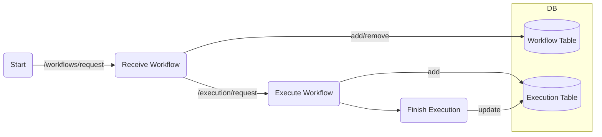

# Dataspace Workflow Execution Engine 

This repository contains ww


## Setup (Development)

Install either with `pip` or `uv`. 

```bash
uv sync --all-extras
```

```bash
pip install -e .[dev]
```

Next, prepare the `.env` file.

```bash
cp .env.example .env
```

Open the `.env` file and specify your api key to access the dataspace.
```
BASE_URL_DLR_CONNECTOR=...
API_KEY_DLR_CONNECTOR=...
```

### Optional: Workflow Graph Editor GUI

Users can create and edit workflow graphs easily by using the pvodied GUI.
The GUI is  is currently demo


## Run

First run

```bash
docker compose up --build
```

Then run the following in another terminal

```bash
python main.py
```

or using `uv`, 

```bash
uv run python main.py
```

## Code Quality

Run `ruff` for formatting and linting via

```bash
ruff format
ruff check
```

Run `mypy` for type checking via


# Example Walk Through

Before we start, setup the graph editor GUI [here](https://gitlab.dlr.de/ki-dataspace/canvas-execution-engine/-/blob/main/react-flow/README.md?ref_type=heads)


### 2. Check the example workflow graph

We will use `test/ex3.json` ([here](https://gitlab.dlr.de/ki-dataspace/canvas-execution-engine/-/blob/main/test/ex3.json?ref_type=heads)) as an example.

To see the graph visually, use the "import (JSON)" feature of the GUI. Just copy+paste the graph JSON into GUI.

There are two nodes `Wine Quality Dataset for Red Wine` and `Wine Quality Dataset for White Wine`, which access the data asset in the dataspace. The parameters are briefly:
- **type**: the node type (which defines the behaviour)
- **adapter_type**: the adapter to communicate with which dataspace connector. Currently only DLR dataspace, but any dataspace connector can be added as a plugin.
- **provider_url**: connector url
- **provider_bpn**: Business Partner Number
- **asset_id**: the asset to be accessed

`Save To File` nodes then save these data into files in the local memory. Its parameter includes:
- **type**: the node type (which defines the behaviour)
- **file_path**: the path to save the data

The node parameters are defined via their `ParamSpec` schema. For instance:
- data_file ([ParamSpec](https://gitlab.dlr.de/ki-dataspace/canvas-execution-engine/-/blob/main/src/cee/node_plugins/nodes/data_file.py?ref_type=heads))
- save_to_file ([ParamSpec](https://gitlab.dlr.de/ki-dataspace/canvas-execution-engine/-/blob/main/src/cee/node_plugins/nodes/save_to_file.py?ref_type=heads))

### 3. Add the workflow into the engine

Open another terminal, and navigate to the `test` directory.

We use a provided script to trigger `http://localhost:8080/workflows`.
```
python inject_workflow.py ex3.json
```
Here, you can use any file instead of ex3.json.

This will add a workflow into the engine's database. To check, access [http://localhost:8080/workflows/show/all](http://localhost:8080/workflows/show/all).

Copy the workflow id and execute:
```
python trigger_execution.py <workflow-id>
```
Substitute your workflow id in the command. This will trigger the execution of the workflow.

After the execution, you will see that `download` folder is created, and two data assets are saved as files (as specified as their respective `file_path` parameter).

> [!WARNING]
> The execution may fail in the first few runs due to the delay in the negotiation. In this case, wait a few mins for the negotiation to finish. Then, attempt again.

### 4. (Optional) Check the database 

You can observe the DB tables using software like [DBeaver](https://dbeaver.io/). 

# Tips

## Overall Operation Lifecycle


Everytime the execution engine runs freshly, the execution table is wiped (reset). 


## Basic Execution Rules

- Every workflow is a DAG (i.e., no loop)
- The I/O of every node is a list of `Item` (definition [here](https://gitlab.dlr.de/ki-dataspace/canvas-execution-engine/-/blob/main/src/cee/schema/execution_schema.py?ref_type=heads)). Therefore, there is never IO type mismatch between nodes.
- Every node has `InputSpec`, `OutputSpec`, and `ParamSpec` schemas (see [here](https://gitlab.dlr.de/ki-dataspace/canvas-execution-engine/-/blob/main/src/cee/node_plugins/base.py?ref_type=heads)).

## Development: adding a new node

1. add a new node class at `src/cee/node_plugins/nodes`
2. register your node in [here](https://gitlab.dlr.de/ki-dataspace/canvas-execution-engine/-/blob/main/src/cee/node_plugins/node_registry.py?ref_type=heads)
3. make sure that your class inherits the [base class](https://gitlab.dlr.de/ki-dataspace/canvas-execution-engine/-/blob/main/src/cee/node_plugins/base.py?ref_type=heads) 

## Development: connecting to another dataspace

1. add a new adapter class at `src/cee/adapters_plugins`
2. register your adapter in [here](https://gitlab.dlr.de/ki-dataspace/canvas-execution-engine/-/blob/main/src/cee/adapters_plugins/adapter_registry.py?ref_type=heads)
3. make sure that your adapter inherits the [base class](https://gitlab.dlr.de/ki-dataspace/canvas-execution-engine/-/blob/main/src/cee/adapters_plugins/adapter.py?ref_type=heads) 


## Additional Notes

Docker registry v2 running 

```
docker run -d \
  --name local-registry \
  -p 5000:5000 \
  --restart=always \
  registry:2
```

Checking the pushed images
```
curl http://localhost:5000/v2/_catalog
```
