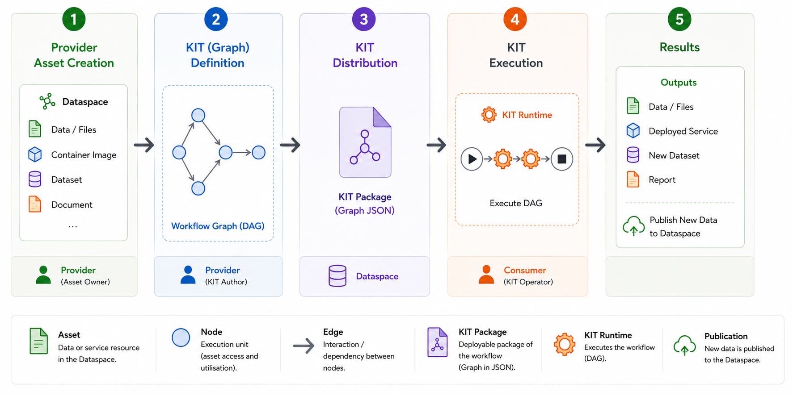

# KIT Concept Overview

The Keep-it-together (KIT) concept aims to 
We utilize these assets within executable workflows with interoperability.

We design workflows to be:

- *Extendable*, by incorporating additional assets.
- *Reconfigurable*, by replacing an asset with another compatible asset.
- *Standardized*, through a common graph representation and predefined execution semantics.
- *Value-generating*, by producing new data assets that enrich the digital ecosystem.

For example, imagine we have a KIT for *pick-and-place digital twin simulation* use case. Then, this KIT is basically a workflow containing dataspace assets such as 3D models, simulation software container, and configuration files.

Long story short, below image shows the overview of the operation flow:

- Step 1. Create assets and contracts in the dataspace
    - The provider user can use the dataspace web portal to create assets and contracts
    - DLR dataspace portal: https://vision-x-dataspace.base-x-ecosystem.org/#/home
    - T-System dataspace portal: https://portal.dih.telekom.com/dataspaces/details/5fd05856-d574-4a27-b8fd-fffd8cb5ca75/ROX-DEV-SPACE
- Step 2. Design a workflow (KIT) using the dataspace assets
    - [Graph specification](./graph_specification.md)
- Step 3. Distribute the KITs
    - KITs can be shared via dataspace as an asset
    - Alternatively, it can simply be sent to the consumer user directly (e.g., via emails)
- Step 4. Execute the KIT and access the required dataspace assets
    - This requires the asset negotiation, which can be done automatically or manually
- Step 5. Result is produced and potentially registred in the dataspace as a new asset
