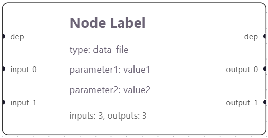
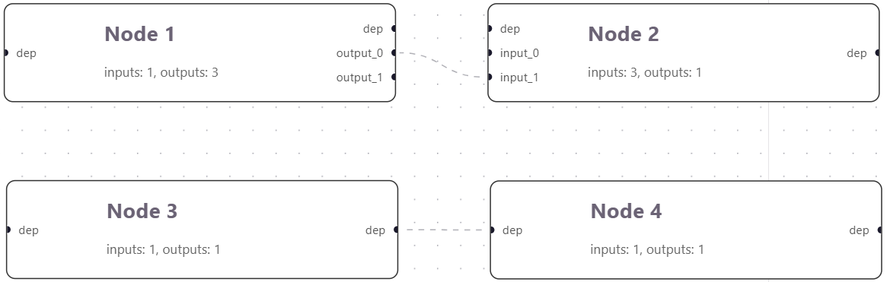
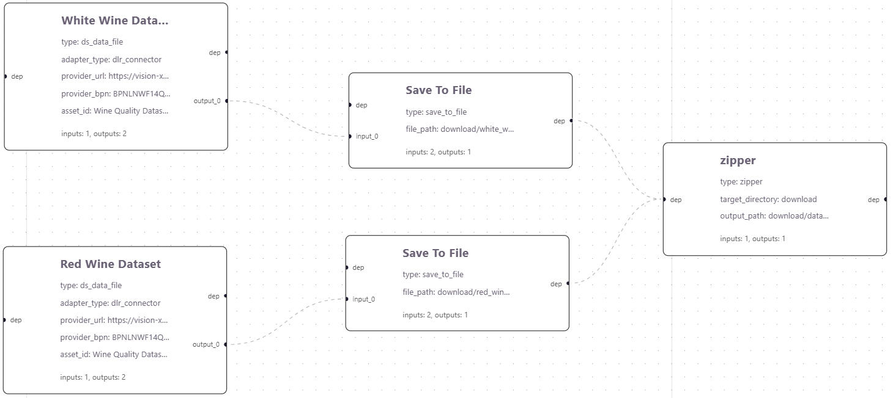

# Workflow Graph Specification

Each workflow is a directed acyclic graph (DAG).

A workflow graph is: 
```json
"Graph": {
    "nodes" : [],
    "edges" : []
}
```

## Node Definition
Each node is a functional unit with a specific behaviour. For example:
- Download a file from dataspace
- Save data to a file
- Build a container image via dataspace
- Deploy software using Kubernetes
- Publish data to dataspace
- Zip/unzip local files

A node looks like below:



- Every node has at least one input and output port. The first I/O ports are reserved for `dep`
- Additional I/O ports are automatically named `input_0, 1, 2, ...` and `output_0, 1, 2, ...`
- Each parameter is a (key:value) pair
- `type` parameter is mandatory. The node type defines the implemented behaviour of the node
- Node Label is a non-unique name for the node

This node is translated into JSON like below:

```json
"nodes": [
    {
      "id": "node-1784293264312",
      "type": "custom",
      "position": {
        "x": 69.5,
        "y": 16.5
      },
      "data": {
        "label": "Node Label",
        "params": {
          "parameter1": "value1",
          "parameter2": "value2"
        },
        "paramOrder": [
          "parameter1",
          "parameter2"
        ],
        "paramTypes": {
          "parameter1": "string",
          "parameter2": "string"
        },
        "inputCount": 3,
        "outputCount": 3
      },
      "measured": {
        "width": 340,
        "height": 146
      },
      "selected": false,
      "dragging": false
    }
  ],
```

## Edge Definition
Each edge captures the dependencies between nodes, either:
- Execution dependency (i.e., one node must execute before another)
- Dataflow dependency (i.e., output is the input to another node)

Below shows edges between 4 nodes.



- The `dep` port does not carry any data. It is used to indicate the execution order.
    - Node 3 and Node 4 are executed sequentially (i.e., Node 4 waits for Node 3)
- Node 1 (`output_0`) carries data to Node 2 (`input_1`)
    - Node 1 is executed before Node 2 due to the data dependency
- Node 1 and Node 3 are executed in parallel as there is no dependency

> [!NOTE]
> The execution order is determined by the **DAG topological sort** algorithm

The above edges are expressed in JSON like below:

```json
"edges": [
    {
      "source": "node-1784294531570",
      "sourceHandle": "output_0",
      "target": "node-1784294535072",
      "targetHandle": "input_1",
      "id": "edge-node-1784294531570-source:output_0-node-1784294535072-target:input_1-1784294551450",
      "animated": true
    },
    {
      "source": "node-1784294760393",
      "sourceHandle": "dep",
      "target": "node-1784294764001",
      "targetHandle": "dep",
      "id": "edge-node-1784294760393-source:dep-node-1784294764001-target:dep-1784294769665",
      "animated": true
    }
  ]
```

The data exchange between nodes is always in the type `Item`.
```python
class Item(BaseModel):
    """Item model."""
    json_data: dict[str, Any] = Field(default_factory=dict)
    binary: bytes
```
The `json_data` part is to carry metadata while `binary` is to pass the actual data content.
If one wants to share a JSON file as data, then it should be passed in `binary`. 
Because, `json_data` is only the description of the data. 


## Already Implemented Nodes

Technically, what's behind the execution of a node is a python script. 
More precisely, depending on the node type, a specific python method is called and executed.
Therefore, it is easy for users to add a new node type, and implement the node's behaviour.

However, for easier usage, we already have a set of node types already implemented.
These already cover typical functionality needed to use the digital ecosystem via the dataspace.
The list of available nodes are explained in [node_list.md](node_list.md)

## Workflow Example

If you are curious about how the workflow graph looks like in JSON, consider the below example (image vs. JSON).

JSON: [graph json](./../test/running_example1.json)

