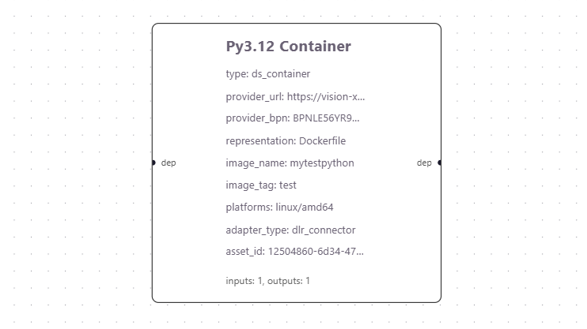

# Running Example 2

We will execute `running_example2.json` in the test directory.

In this example, we build a container image from the dataspace asset.

This example requires Docker installed.
```bash
docker -v
```

The workflow graph looks like this:



## Main observations:
- Node **Py3.12 Container**
    - type `ds_container`: obtain a container image from the dataspace
    - adapter_type `dlr_connector`: talk to the DLR dataspace connector (or `ts_connector` for T-System dataspace)
    - provider_url: the URL of the provider's connector URL
    - provider_bpn: provider's Business Partner Number (BPN)
    - asset_id: ID of the asset to access
    - representation `Dockerfile`: the asset is a Dockerfile
    - platform `linux/amd64`: target deployment platform

## Expected result:
- The python3.12 container image with name:mytestpython and tag:test will be made available in `docker images`.

## Run the workflow:

Keep your backend engine terminal visible to observe the console outputs.

### Run Method 1

In GUI, find the green button on the right top screen, click it

### Run Method 2

Use Rest API to trigger the execution. For now, we can use `curl` at the root directory.

```bash
curl -X POST http://localhost:8080/workflows \
  -H "Content-Type: application/json" \
  --data "{\"workflow_name\":\"my-workflow\",\"graph_json\":$(cat test/running_example1.json)}"
```

In the response, find the `workflow_id` to make the next request (replace `<<workflow_id>>` with the id value)
```bash
curl -X POST http://localhost:8080/execution/request \
  -H "Content-Type: application/json" \
  --data '{"workflow_id":"<<workflow_id>>"}'
```

## Execution Result

Check if the container image `mytestpython:test` is available
```
docker images
```

