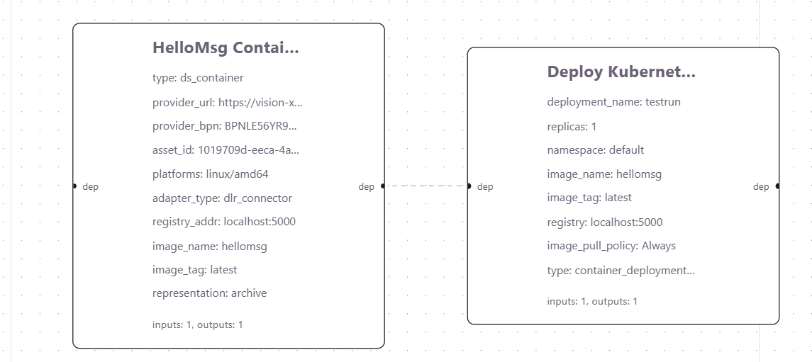

# Running Example 3

We will execute `running_example3.json` in the test directory.

In this example, we:
- build a container image from the dataspace asset
- push it to a local registry
- deploy the image using the kubernetes API.

Thus, you need Docker and access to a Kubernetes cluster, as the application interacts with the Kubernetes API.

A quick check:
```bash
docker -v
sudo kubectl get nodes
```

We also need a local registry:
```bash
cd test
docker compose up -d
```

Check if the local registry is running:
```bash
curl http://localhost:5000/v2/_catalog
```

Note: you can terminate the registry later by `docker compose down -v`.

The workflow graph looks like this:



## Main observations:
- Node **HelloMsg Container**
    - type `ds_container`: obtain a container image from the dataspace
    - adapter_type `dlr_connector`: talk to the DLR dataspace connector (or `ts_connector` for T-System dataspace)
    - provider_url: the URL of the provider's connector URL
    - provider_bpn: provider's Business Partner Number (BPN)
    - asset_id: ID of the asset to access
    - representation `archive`: it can take a zip file containing Dockerfile
        - In this example, what is behind the dataspace asset is a Github repository https://github.com/jinwooro/test3
        - More precisely, the asset holds the URL: https://github.com/jinwooro/test3/archive/refs/heads/main.zip
    - platform `linux/amd64`: target deployment platform
- Node **Deploy Kubernetes**
    - type `container_deployment_kubernetes`: deploy via kubernetes API
    - registry: where to pull the deploy image from
    - image_pull_policy `always`: always re-run the image (even if it is already running)
- `dep` connection
    - While there is no data exchange between nodes, HelloMsg image must be first built before deployment

## Expected result:
- HelloMsg container image is pushed to the local registry and deployed via Kubernetes API

## Execution Result

Check if the container image is available in the local registry
```
curl http://localhost:5000/v2/_catalog
```

Check if the Kubernetes deployment was successful
```
sudo kubectl get deployment
```

